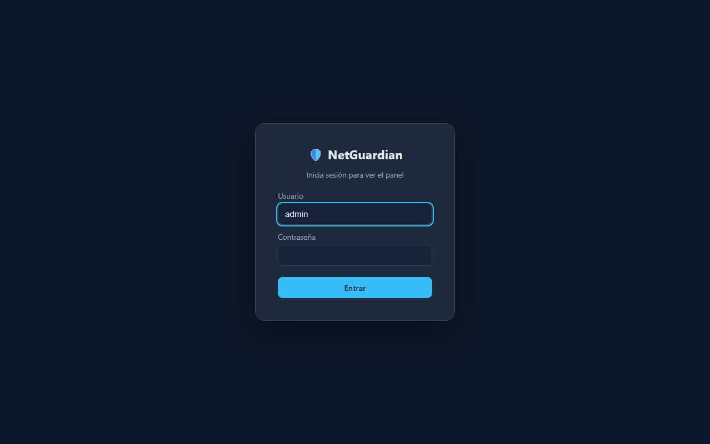
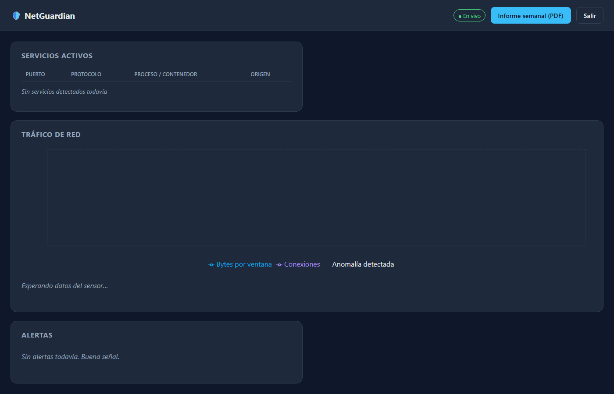

# 🛡️ NetGuardian — IDS con Detección de Anomalías para Homelab

> Sistema de detección de intrusiones que va más allá de las firmas conocidas: aprende el comportamiento normal de tu red doméstica/homelab y detecta anomalías en tiempo real, con un panel que se actualiza solo y descubre automáticamente los servicios activos en tu máquina.

---

## 📋 Tabla de contenidos

1. [Motivación](#-motivación)
2. [Arquitectura](#-arquitectura)
3. [Stack tecnológico](#-stack-tecnológico)
4. [Estructura del repositorio](#-estructura-del-repositorio)
5. [Roadmap y plan de commits](#-roadmap-y-plan-de-commits)
6. [Guía de instalación](#-guía-de-instalación)
7. [Puesta en marcha](#-puesta-en-marcha)
8. [Uso del panel](#-uso-del-panel)
9. [Capturas](#-capturas)
10. [Testing](#-testing)
11. [Resultados y métricas del modelo](#-resultados-y-métricas-del-modelo)
12. [Mejoras futuras](#-mejoras-futuras)
13. [Licencia](#-licencia)

---

## 🎯 Motivación

Los IDS tradicionales (Snort, Suricata) detectan ataques comparando el tráfico contra una base de firmas conocidas. Esto falla contra:

- Ataques nuevos (zero-day)
- Dispositivos IoT comprometidos que empiezan a comportarse "raro" sin coincidir con ninguna firma
- Patrones de exfiltración lentos y silenciosos

**NetGuardian** ataca este problema desde otro ángulo: en lugar de firmas, aprende el comportamiento normal de tu red (nº de conexiones, puertos usados, volumen de tráfico, IPs habituales) y usa un modelo de detección de anomalías para señalar lo que se sale de ese patrón — todo esto visualizado en un panel que se actualiza solo, sin que tengas que tocar nada.

---

## 🏗️ Arquitectura

```
┌─────────────────────────────────────────────────────────────┐
│                        SENSOR (daemon)                       │
│                                                                │
│  ┌──────────────────┐  ┌──────────────────┐  ┌─────────────┐│
│  │ Descubridor de    │  │ Capturador de    │  │ Extractor   ││
│  │ servicios         │  │ tráfico          │  │ de features ││
│  │ (psutil / docker) │  │ (Scapy)          │  │             ││
│  └────────┬─────────┘  └────────┬─────────┘  └──────┬──────┘│
│           └─────────────────────┴────────────────────┘       │
│                              │                                │
│                    ┌─────────▼─────────┐                     │
│                    │  Modelo ML         │                     │
│                    │  (Isolation Forest)│                     │
│                    └─────────┬─────────┘                     │
└──────────────────────────────┼────────────────────────────────┘
                                │
                    ┌───────────▼───────────┐
                    │   Base de datos        │
                    │   (SQLite / InfluxDB)  │
                    └───────────┬───────────┘
                                │
                    ┌───────────▼───────────┐
                    │   Backend API          │
                    │   (FastAPI + WebSocket)│
                    └───────────┬───────────┘
                                │
                    ┌───────────▼───────────┐
                    │   Panel web            │
                    │   (React + Recharts)   │
                    │   auto-refresh en vivo │
                    └───────────────────────┘
                                │
                    ┌───────────▼───────────┐
                    │  Notificaciones        │
                    │  (Telegram / Discord)  │
                    └───────────────────────┘
```

**Flujo resumido:**

1. El sensor descubre qué servicios/procesos están activos en la máquina cada N segundos.
2. Captura tráfico de red en ventanas de tiempo cortas.
3. Calcula features numéricas por ventana.
4. El modelo ML clasifica cada ventana como normal o anómala.
5. Todo se guarda en base de datos y se empuja al panel vía WebSocket.
6. Si hay una alerta, se dispara una notificación (y opcionalmente una acción de bloqueo).

---

## 🧰 Stack tecnológico

| Capa | Tecnología | Por qué |
|---|---|---|
| Sensor / captura | Python + Scapy | Estándar para manipulación de paquetes, buena documentación |
| Descubrimiento de servicios | psutil + Docker SDK | Acceso a procesos y puertos sin depender de nmap externo |
| Modelo ML | scikit-learn (Isolation Forest) | Simple, rápido, no necesita GPU, ideal para detección de anomalías no supervisada |
| Base de datos | SQLite (fase inicial) → InfluxDB (fase avanzada) | SQLite para arrancar rápido, InfluxDB cuando pienses en series temporales de verdad |
| Backend | FastAPI | Async nativo, WebSockets fáciles, documentación automática (Swagger) |
| Frontend | React + Vite + Recharts | Rápido de montar, gráficos en tiempo real sencillos |
| Notificaciones | python-telegram-bot / discord.py | Alertas fuera del panel, útil si no estás mirando la pantalla |
| Contenedores | Docker + docker-compose | Para desplegar todo el stack de un solo comando |

---

## 📁 Estructura del repositorio

```
netguardian/
├── README.md
├── .gitignore
├── docker-compose.yml
├── sensor/
│   ├── main.py
│   ├── discovery.py        # descubre servicios/procesos activos
│   ├── capture.py          # captura de tráfico con Scapy
│   ├── features.py         # extracción de features por ventana
│   ├── model.py            # entrenamiento/inferencia Isolation Forest
│   ├── notifier.py         # envío de alertas (Telegram/Discord)
│   └── requirements.txt
├── backend/
│   ├── main.py              # FastAPI app
│   ├── routes/
│   │   ├── services.py
│   │   ├── alerts.py
│   │   └── ws.py
│   ├── db.py
│   └── requirements.txt
├── frontend/
│   ├── src/
│   │   ├── components/
│   │   │   ├── ServicesPanel.jsx
│   │   │   ├── TrafficChart.jsx
│   │   │   └── AlertsFeed.jsx
│   │   ├── App.jsx
│   │   └── main.jsx
│   ├── package.json
│   └── vite.config.js
├── data/
│   └── models/               # modelos entrenados serializados
├── tests/
│   ├── test_features.py
│   └── test_model.py
└── docs/
    └── capturas/              # screenshots para el README final
```

---

## 🗺️ Roadmap y plan de commits

La idea es que cada fase termine con un commit funcional y comprobable — nada de un único commit gigante al final. Esto también te da una buena historia que contar en la entrevista ("empecé por X, luego añadí Y").

### Fase 0 — Setup inicial
- [ ] `chore: inicializar repositorio con estructura de carpetas`
- [ ] `chore: añadir .gitignore, README inicial y licencia`
- [ ] `chore: configurar entorno virtual y requirements.txt base`

### Fase 1 — Descubrimiento de servicios
- [ ] `feat: descubridor de procesos y puertos activos con psutil`
- [ ] `feat: integración con Docker SDK para listar contenedores activos`
- [ ] `test: pruebas unitarias del módulo de descubrimiento`

### Fase 2 — Captura de tráfico
- [ ] `feat: captura básica de paquetes con Scapy`
- [ ] `feat: agrupación de paquetes en ventanas temporales`
- [ ] `refactor: extraer configuración de interfaz de red a variables de entorno`

### Fase 3 — Extracción de features y modelo
- [ ] `feat: cálculo de features por ventana (nº conexiones, IPs, puertos, bytes)`
- [ ] `feat: entrenamiento inicial de Isolation Forest con datos normales`
- [ ] `feat: pipeline de inferencia en tiempo real sobre nuevas ventanas`
- [ ] `test: pruebas del pipeline de features y del modelo`

### Fase 4 — Persistencia
- [ ] `feat: modelo de base de datos SQLite para servicios, tráfico y alertas`
- [ ] `feat: capa de acceso a datos (repositorio/DAO)`

### Fase 5 — Backend API
- [ ] `feat: endpoints REST para servicios activos y alertas`
- [ ] `feat: endpoint WebSocket para streaming en tiempo real`
- [ ] `docs: documentación automática con Swagger/FastAPI`

### Fase 6 — Notificaciones
- [ ] `feat: integración con bot de Telegram para alertas`
- [ ] `feat: reglas configurables de cuándo notificar`

### Fase 7 — Frontend
- [ ] `feat: scaffold de React con Vite`
- [ ] `feat: panel de servicios activos con auto-refresh`
- [ ] `feat: gráfico de tráfico en tiempo real con Recharts`
- [ ] `feat: feed de alertas en vivo vía WebSocket`
- [ ] `style: pulido visual del dashboard`

### Fase 8 — Dockerización y despliegue
- [ ] `feat: Dockerfile para sensor, backend y frontend`
- [ ] `feat: docker-compose.yml para levantar todo el stack`
- [ ] `docs: instrucciones de despliegue en homelab`

### Fase 9 — Cierre y documentación final
- [ ] `docs: capturas de pantalla del panel en funcionamiento`
- [ ] `docs: sección de resultados y métricas del modelo`
- [ ] `chore: limpieza final de código y comentarios`

> 💡 Consejo: haz cada checkbox un commit real, aunque sea pequeño. Un historial de 30-40 commits con mensajes claros dice mucho más de ti en una entrevista técnica que 3 commits enormes.

---

## ⚙️ Guía de instalación

### Requisitos previos

- Python 3.11+
- Node.js 18+
- Docker y docker-compose
- Permisos de administrador/root en la máquina donde corra el sensor (necesario para capturar tráfico de red)

### 1. Clonar el repositorio

```bash
git clone https://github.com/TU-USUARIO/netguardian.git
cd netguardian
```

### 2. Crear el entorno virtual del sensor y del backend

```bash
python3 -m venv venv
source venv/bin/activate    # En Windows: venv\Scripts\activate
pip install -r sensor/requirements.txt
pip install -r backend/requirements.txt
```

### 3. Instalar dependencias del frontend

```bash
cd frontend
npm install
cd ..
```

### 4. Variables de entorno

Copia la plantilla y ajústala a tu red:

```bash
cp .env.example .env
```

`.env.example` es la referencia siempre actualizada de toda la configuración disponible (sensor, base de datos, modelo, notificaciones, auto-bloqueo, auth y backend). Como mínimo revisa:

```env
NETWORK_INTERFACE=eth0        # interfaz real de tu máquina/homelab (ip a / ipconfig)
WINDOW_SECONDS=30
DB_PATH=./data/netguardian.db
TELEGRAM_BOT_TOKEN=           # opcional, para alertas por Telegram
TELEGRAM_CHAT_ID=
AUTH_SECRET_KEY=              # cámbialo por una cadena larga y aleatoria
ADMIN_PASSWORD_HASH=          # genera el hash con el comando que indica .env.example
```

Genera el frontend/.env con la URL del backend (`cp frontend/.env.example frontend/.env`) si el backend no corre en `localhost:8000`.

---

## 🚀 Puesta en marcha

### Opción A — Modo desarrollo (paso a paso)

```bash
# Terminal 1: sensor
cd sensor
sudo python3 main.py

# Terminal 2: backend
cd backend
uvicorn main:app --reload --port 8000

# Terminal 3: frontend
cd frontend
npm run dev
```

Inicia sesión con `ADMIN_USERNAME` y la contraseña cuyo hash pusiste en `ADMIN_PASSWORD_HASH` (o pon `AUTH_ENABLED=false` en `.env` para desarrollo sin login).

Accede al panel en `http://localhost:5173`.

### Opción B — Con Docker (recomendado para el homelab)

```bash
docker-compose up --build -d
```

Esto levanta sensor, backend y frontend con un solo comando, listo para dejar corriendo 24/7 en tu servidor/homelab.

Para ver logs en vivo:

```bash
docker-compose logs -f
```

Para detener todo:

```bash
docker-compose down
```

### 🏠 Despliegue en homelab (24/7)

- **Copia `.env.example` a `.env`** antes de levantar el stack y ajusta al menos `NETWORK_INTERFACE` (mira la interfaz real con `ip a` en el host) y `AUTH_SECRET_KEY`/`ADMIN_PASSWORD_HASH` si vas a exponer el panel.
- **`network_mode: host` en el sensor solo funciona en Linux.** Es imprescindible para que Scapy vea el tráfico real de tu red en vez del tráfico interno del contenedor. En Docker Desktop (Windows/macOS) el sensor arrancará pero no capturará tráfico útil del host — para desarrollar en esas plataformas, ejecuta el sensor en modo local (Opción A) contra tu interfaz real.
- **Arranque automático al reiniciar el host:** `docker-compose` ya usa `restart: unless-stopped`, así que basta con que Docker arranque con el sistema (`systemctl enable docker` en la mayoría de distros).
- **Persistencia:** `./data` (base SQLite + modelos entrenados) y `./reports` (PDFs semanales) están montados como volúmenes — sobreviven a `docker-compose down` y a reconstrucciones de imagen. Haz backup periódico de `./data/netguardian.db` si te importa el histórico.
- **Exponer el panel fuera de tu LAN:** el JWT del panel (`AUTH_ENABLED=true`) protege el acceso, pero viaja sin cifrar si no añades HTTPS. Pon un reverse proxy con TLS delante (Caddy, Traefik o nginx con Let's Encrypt) en vez de exponer el puerto 5173/8000 directamente a Internet.
- **Logs:** `docker-compose logs -f sensor` para ver alertas y anomalías en vivo, o `docker-compose logs -f backend` para ver la actividad de la API/WebSocket.
- **Actualizar tras un `git pull`:** `docker-compose up --build -d` reconstruye solo las imágenes cuyo contexto cambió.

---

## 🖥️ Uso del panel

Una vez levantado, el panel muestra tres bloques principales, todos actualizados automáticamente sin recargar la página:

- **Servicios activos**: lista en vivo de procesos/contenedores detectados en la máquina, con puerto y protocolo.
- **Gráfico de tráfico**: volumen de conexiones y bytes por ventana de tiempo, con el umbral de anomalía marcado.
- **Feed de alertas**: cada vez que el modelo detecta una anomalía, aparece aquí con detalle (IP origen, puerto, motivo) y se dispara la notificación configurada.

---

## 📸 Capturas

Pantalla de login (autenticación JWT del panel):



Dashboard con los tres bloques en vivo (servicios, tráfico y alertas) conectado por WebSocket:



> Capturadas con el stack real corriendo (backend + frontend), verificando también que no hay errores de consola y que el WebSocket llega a "En vivo". Los paneles aparecen vacíos porque el sensor no estaba capturando tráfico real en el momento de la captura.

---

## 🧪 Testing

Todos los tests viven en `tests/` en la raíz (un único `conftest.py` añade `sensor/`, `backend/` y la raíz del repo a `sys.path`, así que los módulos de cada servicio se importan directamente por nombre):

```bash
python -m venv venv
source venv/bin/activate        # Windows: venv\Scripts\activate
pip install -r requirements-dev.txt

cd tests
pytest -q
```

65 tests cubren descubrimiento de servicios, captura/ventaneo de paquetes, extracción de features, el modelo (Isolation Forest global y per-IP), persistencia SQLite, la API del backend (auth, REST, WebSocket, PDF) y la orquestación completa del sensor.

> **Nota de esta máquina de desarrollo:** los tests de `sensor/model.py` (y, por dependencia, los que instancian `Sensor` de verdad) no se han podido ejecutar aquí porque una directiva de Application Control de Windows bloquea el DLL nativo de scikit-learn (`_tree.pyd`). No es un problema del código: `pip install scikit-learn` se completa sin error, solo falla el `import` en tiempo de ejecución. Si tu máquina no tiene esa restricción, `pytest -q` debería dar 100% en verde. Los tests de orquestación (`test_sensor_main.py`) sortean esto sustituyendo `model.py` por un doble de prueba equivalente, así que sí verifican todo el flujo descubrimiento → ventana → anomalía → alerta → bloqueo.

---

## 📊 Resultados y métricas del modelo

`sensor/evaluate.py` entrena un Isolation Forest con tráfico "normal" sintético y mide cuántas muestras de tres patrones de ataque simulados detecta (escaneo de puertos, flood tipo DDoS, exfiltración de datos), además de la tasa de falsos positivos sobre tráfico normal que no ha visto en el entrenamiento:

```bash
cd sensor
python evaluate.py
```

Es una prueba de humo con patrones exagerados a propósito, no un benchmark: sirve para comprobar que el modelo distingue lo obvio antes de dejarlo correr contra tu tráfico real, no para prometer una tasa de detección concreta en producción (eso depende de tu red, de `MODEL_CONTAMINATION` y de cuánto tráfico normal haya visto el modelo antes de evaluarse).

Por la misma directiva de Windows mencionada en la sección de Testing, no se ha podido ejecutar este script en esta máquina para pegar aquí una salida real. Si lo ejecutas en la tuya, verás algo con esta forma:

```
=== NetGuardian — evaluación del modelo con tráfico sintético ===

Falsos positivos sobre tráfico normal: X/200 (X.X%)

Detección por tipo de ataque simulado:
  port_scan      XX/50 (XX.X%)
  ddos_flood     XX/50 (XX.X%)
  exfiltration   XX/50 (XX.X%)
```

La métrica que más importa en el día a día no es esta, sino la que ves en el propio panel: cuántas alertas reales genera tu red durante una semana normal (para ajustar `MODEL_CONTAMINATION` y `NOTIFY_MIN_SEVERITY` si hay demasiado ruido) — para eso está el informe semanal en PDF (`GET /api/reports/weekly`).

---

## 🔮 Mejoras futuras

- Migrar de SQLite a InfluxDB + Grafana para análisis histórico más potente.
- Añadir bloqueo automático de IPs sospechosas vía `iptables` (con lista blanca de seguridad para no bloquearte a ti mismo).
- Entrenar un modelo por dispositivo/IP en vez de uno global, para detectar anomalías más finas.
- Añadir autenticación al panel si se expone fuera de la red local.
- Exportar informes semanales de actividad en PDF.

---

## 📄 Licencia

MIT — usa, modifica y comparte este proyecto libremente citando la fuente.
